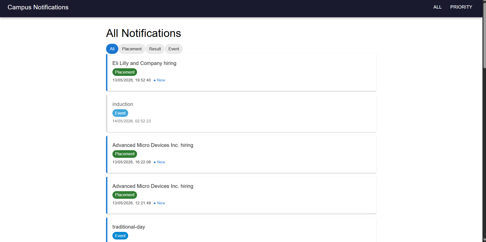

# Stage 1

## Overview

The Campus Notifications Microservice is a priority-based notification system designed for students to receive real-time updates regarding Placements, Events, and Results. The core challenge addressed in Stage 1 is information overload — students lose track of important notifications due to high volume. The solution is a **Priority Inbox** that always surfaces the top 10 most important unread notifications first.

---

## Problem Statement

Students receive a continuous stream of notifications across three categories:
- **Placement** — Job/internship hiring updates
- **Result** — Academic results (mid-sem, project-review, external)
- **Event** — Campus events (tech-fest, farewell, etc.)

Without prioritization, critical placement notifications get buried under event updates. This system solves that by scoring and ranking every notification.

---

## Priority Algorithm

### Weight Assignment

Each notification type is assigned a weight based on urgency:

| Type | Weight |
|---|---|
| Placement | 3 (Highest) |
| Result | 2 (Medium) |
| Event | 1 (Lowest) |

### Recency Factor

Newer notifications score higher. Age is calculated in hours from current time:

```
ageHours = (currentTime - notificationTimestamp) / (1000 * 60 * 60)
```

### Score Formula

```
score = (weight * 100) - ageHours
```

### Why This Works

- A brand new Placement scores ~300, an old Event scores much lower
- Among same-type notifications, newer ones always rank higher
- Top N are selected by sorting scores in descending order

---

## Maintaining Top 10 as New Notifications Arrive

Since new notifications keep coming in continuously:

1. The API is called fresh on every page load — no stale cache
2. Scores are **recalculated dynamically** every time based on current timestamp
3. As time passes, older notifications naturally drop in score
4. A brand new Placement notification immediately rises to rank 1
5. Users can also adjust N (5 to 20) using the slider in real time

This means the Priority Inbox always reflects the **current most important** notifications automatically.

---

## Data Flow

```
GET /notifications (with Auth token)
           ↓
   Receive all notifications
           ↓
   Apply type filter (optional)
           ↓
   Calculate score for each notification
           ↓
   Sort by score descending
           ↓
   Slice top N results
           ↓
   Display in Priority Inbox
```

---

## API Used

```
GET http://4.224.186.213/evaluation-service/notifications
```

Auth: Bearer token sent in Authorization header

---

## Logging

Every action is logged using `Log(stack, level, package, message)`:

| Event | Level |
|---|---|
| Page load | INFO |
| API fetch start | INFO |
| API success | INFO |
| API failure | ERROR |
| Score calculation | DEBUG |

---

## Output Screenshots

### Top 10 Priority Notifications — Desktop View



---

# Stage 2

## Overview

Stage 2 builds the complete React frontend for the Campus Notifications platform. It includes two pages — an All Notifications page and a Priority Inbox page — both fully responsive across desktop and mobile. The app runs on `http://localhost:3000` and is styled using Material UI.

---

## Pages Built

### Page 1 — All Notifications

Displays every notification fetched from the API with the following features:
- Distinguishes **new vs already viewed** notifications visually
- Blue left border and bold text = new notification
- Grey border and lighter text = already viewed
- Filter chips to filter by type (All / Placement / Result / Event)
- Click any notification to mark it as viewed

### Page 2 — Priority Inbox

Displays only the top N most important notifications with:
- Slider to control N (5 to 20)
- Dropdown to filter by notification type
- Priority score calculated using weight + recency formula from Stage 1
- Most important notifications always shown at the top

---

## New vs Viewed Logic

Since the assignment says no database or localStorage is needed:
- A `Set` of viewed notification IDs is kept in React state
- When a user clicks a notification, its ID is added to the Set
- On re-render, cards check if their ID is in the Set to decide styling
- This resets on page refresh (intentional — no persistence required)

---

## Component Structure

```
src/
├── utils/
│   ├── config.js           ← API credentials
│   ├── logger.js           ← Log() middleware
│   ├── api.js              ← fetch notifications
│   └── priorityEngine.js  ← top-N scoring algorithm
├── pages/
│   ├── AllNotifications.jsx
│   └── PriorityInbox.jsx
├── components/
│   ├── Navbar.jsx
│   └── NotificationCard.jsx
└── App.js
```

---

## API Query Parameters Used

| Parameter | Used For |
|---|---|
| `limit` | Fetch specific number of notifications |
| `page` | Pagination support |
| `notification_type` | Server-side type filtering |

---

## Logging Strategy (Stage 2)

| Event | Level | Package |
|---|---|---|
| Page mount | INFO | AllNotifications / PriorityInbox |
| API fetch | INFO | api |
| API success | INFO | api |
| API error | ERROR | api |
| Notification clicked | DEBUG | NotificationCard |
| Filter changed | DEBUG | AllNotifications |
| Slider changed | DEBUG | PriorityInbox |
| Navigation | INFO | Navbar |

---

## Error Handling

- API failures show an empty state gracefully (no crash)
- Logger fails silently so it never breaks the UI
- All fetch calls wrapped in try/catch blocks
- 401 errors are caught and logged with full message

---

## Output Screenshots

### All Notifications — Desktop View


### All Notifications — Mobile View


### Priority Inbox — Desktop View


### Priority Inbox — Mobile View


---

## Video Demo — Stage 2

[Click here to watch Stage 2 demo](https://drive.google.com/file/d/1WBxB3bubcSrBp3ZZNUUD1x1aV69trbtF/view?usp=sharing)

---

## Tech Stack

| Layer | Technology |
|---|---|
| Framework | React.js (JavaScript) |
| Styling | Material UI |
| Routing | React Router DOM |
| Logging | Custom Log() middleware |
| API | REST — AffordMed Evaluation Service |

---

## Folder Structure (Full Repo)

```
notification-system/
├── logging_middleware/
│   └── logger.js
├── notification_app_be/
├── notification_app_fe/
│   └── src/
│       ├── utils/
│       ├── pages/
│       └── components/
├── screenshots/
│   ├── stage1-priority-desktop.png
│   ├── stage1-console-output.png
│   ├── stage2-all-desktop.png
│   ├── stage2-all-mobile.png
│   ├── stage2-priority-desktop.png
│   └── stage2-priority-mobile.png
├── Notification_System_Design.md
└── .gitignore
```